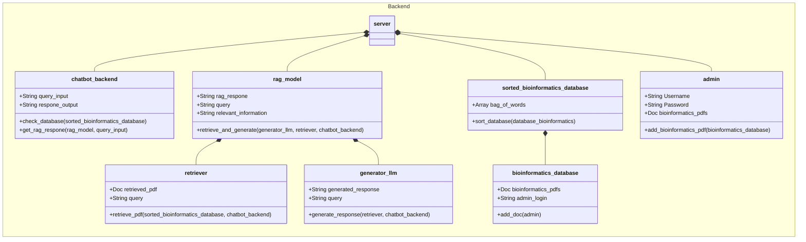

<!--Overview Section-->
# Backend API 

## __Chatbot_backend__
+ Class Purpose: To receive query from the user and generate a RAG(Retrieval-augmented generation) response
+ Datafields:
  + query_input (String): Store the user query
  + response_output (String): Store the RAG-generated response
+ Methods:
  + check_database()
      + Purpose: Checks for relevant information in the database.
      + Pre-Conditon: A parsed user query
      + Parameters:
        + query_input (String) : The user query
        + database (Object) : The sourced of stored information
      + Return value: True if relevant data exists, False otherwise (Boolean)
  + generate_response()
      + Purpose: Generate RAG(Retrieval-augmented generation) response or a message stating "I don't know"
      + Pre-Conditon: A boolean from check_database()
      + Post-Conditon: A response for the Chatbot to display
      + Parameters:
        + relevant_info(Boolean) : Boolean that checks for relevant information in the database
        + rag_model(Object) : The RAG class object that generate RAG(Retrieval-augmented generation) response
      + Return value: RAG response if boolean true, "I don't know" message if boolean false (String)

## __Rag_model__
+ Class Purpose: Generate a respone for the chatbot query from retrieval infomation and a LLM (Large Language Model)
+ Datafields:
  + query_input (String): Store the user query
  + response_output (String): Store the RAG-generated response
  + relevant_information(String): Relevant information from the database
+ Methods:
  + retrieve_information()
      + Purpose: Retrieve relevant information in the database based on the user query.
      + Pre-Conditon: A index database
      + Parameters:
        + query_input (String) : The user query
        + sorted_database (Object) : The sorted database containing all the information
      + Return value: only containing relevant information (String)
    + generate_rag_response()
      + Purpose: Generates a RAG response using LLM and the relevant information.
      + Pre-Conditon: Relevant information recieved 
      + Parameters:
        + relevant_information(String): Relevant information from the database
        + LLM (Object) : Large language model use to generate RAG response from relevant information
      + Return value: RAG response from the LLM (String)

## __Sorted Database__
+ Class Purpose: Parsed and index Bioinformatics pdfs files
+ Datafields:
  + File (Object)
  + Unsorted_database (Object): Unsorted database contain files added by Admin.
  + Sorted_database (Object): After parsing and indexing the information into a sorted database.
+ Methods:
  + parse_information()
      + Purpose: Parse infomation from the files.
      + Pre-Conditon: Files has to be pdfs 
      + Parameters:
        + File (String) : Bioinformatics pdf file
      + Return value: Information from Bioinformatics pdf file (String)
    + index_information()
      + Purpose: Index the information into a sorted database.
      + Post-Condtion: Sorted database 
      + Parameters:
        + parsed_info (String) : Information from Bioinformatics pdf file
        + Sorted_database (Object) : The reference of the sorted_database
     
   
## __Admin__
+ Class Purpose: A safe and secure place to add Bioinformatics pdfs files for Database
+ Datafields:
  + Username (String)
  + Password (String)
  + File (Object)
  + Unsorted_database (Object): Unsorted database contain files added by Admin.
+ Methods:
  + add_files()
      + Purpose: Add Bioinformatics pdfs files for Database
      + Pre-Conditon: Files has to be pdfs
      + Post-Conditon: Database filled with Bioinformatics pdfs files
      + Parameters:
        + File (Object) : Bioinformatics pdfs files
        + Unsorted_database (Object) : The reference of the unsorted_database
    
  
