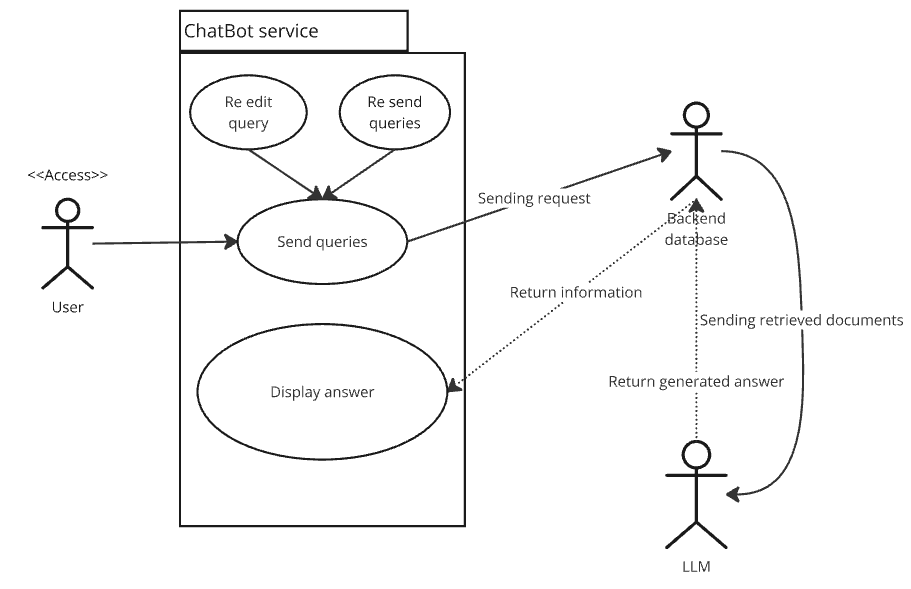
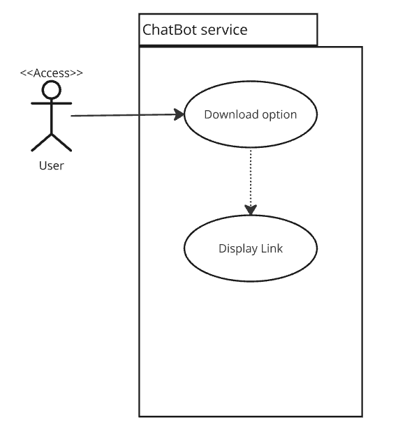
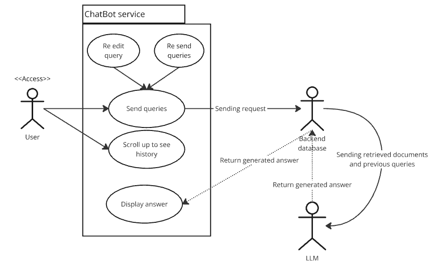
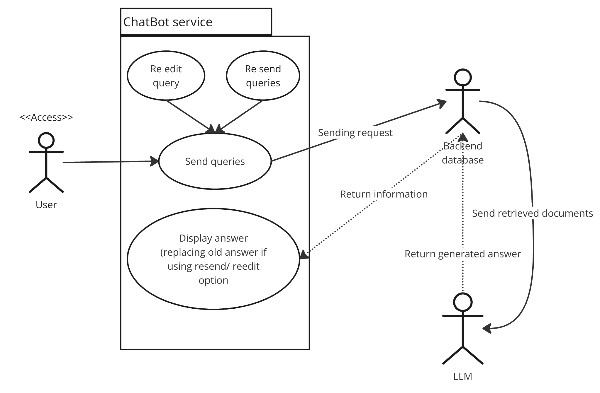
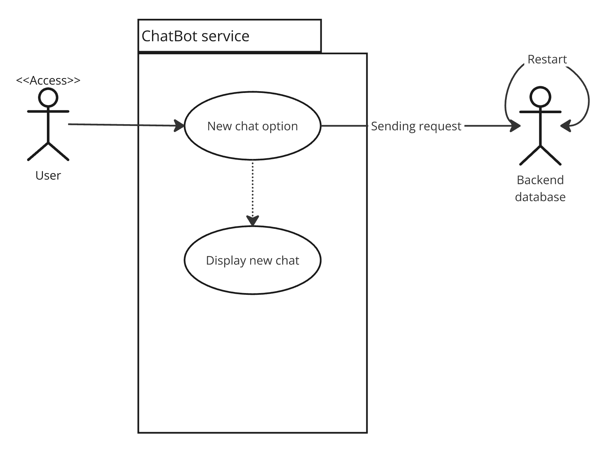
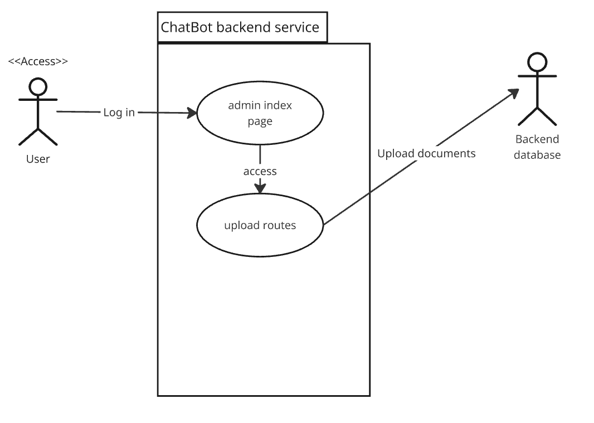
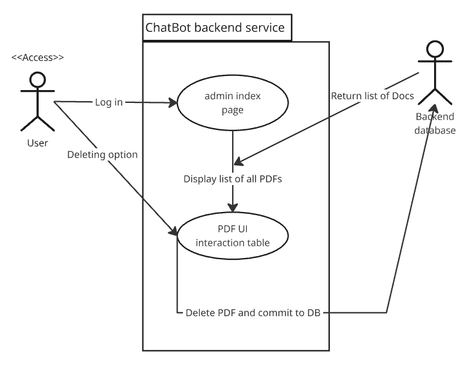
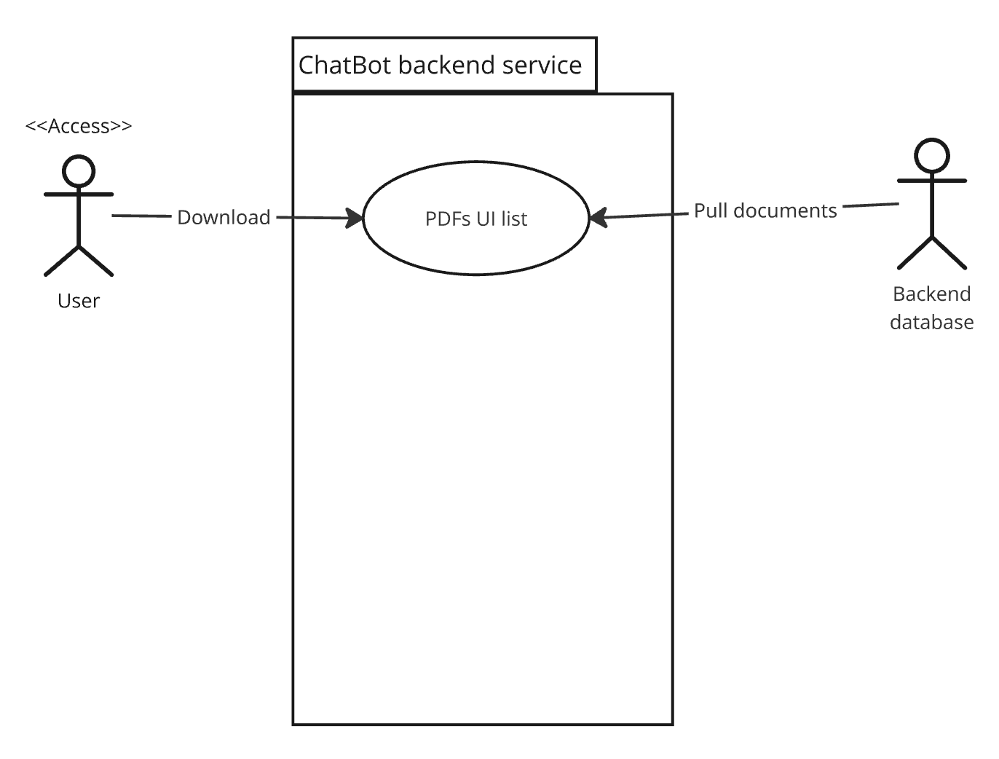

# Use-Case Descriptions

## Use Case 1 - ChatBot Question and Answer System

Users should have the ability to ask the chatbot questions related to bioinformatics for adequate responces.

1. The user clicks on the weblink and is brought to our website's front page.
2. A question is inputted into the chatbox.
3. The chatbot processes the question to understand how to answer.
4. The chatbot determines the answer by the following criteria:

    - If the answer is found from the documentation:
        - A tutorial will pop up with the method of choice for the user to use for his or her Bioinformatics Research.

    - If the answer is not found in the documentation:
        - The chatbot will say "I don't know" as an answer for the user.
#### Diagrams      

  
*Figure 1: ChatBot Question and Answer System*

## Use Case 2 - Downloading Conversation

As a user, I should have the functionality of downloading the conversation between myself and the chatbot to refrence at a later date.

1. A conversation between the user and chatbot has finished.

2. The user selects the "Download Conversation" button and decides which format (.pdf, .txt, .md, etc) to save the file as.

3. A notification appears on the screen that the download is ready to be saved to the user's computer.

4. The user presses the "Save" button to save the history of the converstation with the chatbot file to their device.
#### Diagrams   
  
*Figure 2: ChatBot downloading conversation System*

## Use Case 3 - Chat History

Users shoud be able view previous conversations with the chatbot and ask new question. New question with answer will use previous queries for refrencing.

1. The chatbot and the user are currently in conversation with one another.
2. The user navigates to the scroll bar.
3. He or she moves the bar up or down so that the past conversations are shown on the screen.
#### Diagrams   

  
*Figure 3: ChatBot History System*
## Use Case 4 - Edit Queue/Resend

As a user, I should be allowed to modify previously sent messages or resend messages for another response.
#### All of the message after the point of editing will be remove from context and screen.
1. The chatbot gave an answer that the user was unsatisfied with.
2. The user highlights over the question asked.
3. He or she selects the edit icon.
4. The user has the option to update the message before resending.
5. The user clicks send and the chatbot reanwers the question.

#### Diagrams   

  
*Figure 4: ChatBot re-edit/ re-send queries System*

## Use Case 5 - New/clear Chat

Users should have the ability to create a new chat with the chatbot.

#### Hitting refresh will not clear the chat session ONLY closing the tab on browser and reaccess will open new chat

1. The user selects the "New Chat" button.
2. An alert message pops up on the screen stating "Creating a new chat also clears the chat. Do you wish to continue?".
3. The user selects yes, and the chat is cleared to start a new conversation.

### Diagrams   
  
*Figure 5: ChatBot open new chat System*

## Use Case 6 - Upload documents 
#### (ADMIN / PRODUCT OWNER only)

Users should have the ability to upload documents to the chatbot.

1. The user login then get redirect to admin dashboard.
2. User then select upload option and get redirected to upload page.
3. The user selects ONLY pdf document files to database.

### Diagrams   
  
*Figure 6: ChatBot upload document System*

## Use Case 7 - Delete PDF 
#### (ADMIN / PRODUCT OWNER only)

Admin/ Product owner should have the ability to delete PDF documents uploaded

1. The user login then get redirect to admin dashboard. 
2. User will see red color delete option in PDF UI table
3. User click on delete and PDF will be instantly deleted from Database.

  
*Figure 7: ChatBot delete document System*

## Use Case 8 - Download PDF  

### All user should be able to see the list of PDFs uploaded without logging in to backend.

  
*Figure 8: ChatBot downloading document System*

## Use Case 9 - Admin Login 
#### (ADMIN / PRODUCT OWNER only)

Admin / Product owner should be able to log in to backend service app to perform deleting PDFs, uploading PDFs, changing password.

  
*Figure 9: Backend service log in System*

