<!--Overview Section-->
# Class Diagram

## __Overview__

```mermaid
classDiagram
direction TT
	namespace Frontend {
        class homepage {
	        +display()
        }

        class chat_history {
	        +String history
	        +add_history(user, chatbot_frontend)
        }

	class user_textbubble {
	        +String user_response
		+get_user_response(user)
        }

        class chatbot_textbubble {
	        +String chatbot_response
		+get_chatbot_response(chatbot)
        }

        class user {
	        +String query_input
	        +String edit_query_input
	        +edit_query(query_input, edit_query_input)
        }

        class textbox {
	        +String query
	        +get_query(user)
        }

        class send_button {
	        +get_query(textbox)
	        +send_query(chatbot_frontend)
        }

        class download_button {
	        +String history
	        +get_history(chat_history)
	        +download(history)
        }

        class chatbot_frontend {
	        +String query_input
	        +String respone_output
	        +generate_rag_respone()
        }

	}
	namespace Backend {
        class server {
        }

        class chatbot_backend {
	        +String query_input
	        +String respone_output
	        +check_database(parsed_bioinformatics_database)
                +get_rag_respone(rag_model, query_input)
        }


        class rag_model {
	        +String rag_respone
                +String query
	        +retrieve_and_generate(generator_llm, retriever, chatbot_backend)
        }

        class retriever {
	        +Doc retrieved_pdf
                +String query
	        +retrieve_pdf(parsed_bioinformatics_database, chatbot_backend)
        }


        class generator_llm {
	        +String generated_response
		+String query
	        +generate_response(retriever, chatbot_backend)
        }

        class bioinformatics_database{
	        +Doc bioinformatics_pdfs
	        +String admin_login
	        +add_doc(admin)
        }

        class parsed_bioinformatics_database{
            +Array bag_of_words
            +parsed_database(bioinformatics_database)
        }


        class admin {
	        +Doc bioinformatics_pdfs
	        +add_bioinformatics_pdf(bioinformatics_database)
        }

	}

    homepage *-- user
    homepage *-- textbox
    homepage *-- chatbot_frontend
    homepage *-- chat_history
    textbox *-- send_button
    textbox *-- download_button
    chat_history *-- user_textbubble
    chat_history *-- chatbot_textbubble

    chatbot_frontend --> chatbot_backend

    server *-- chatbot_backend
    server *-- parsed_bioinformatics_database
    server *-- rag_model
    rag_model *-- generator_llm
    rag_model *-- retriever
    server *-- admin
    parsed_bioinformatics_database *-- bioinformatics_database
    


```

The class diagram above demonstrates various relationships between different classes within the two components of Frontend and Backend in the bioinformatics chatbot system. The frontend is connected to the backend through the chatbot component. 

<!-- Frontend section -->
## __Frontend__

The frontend component shows the homepage where everything will be displayed. The homepage will be composed of the chat_history, user, textbox, and chatbot_frontend. 
+ Chat_history is going to store all the respones from user and chatbot
  + User_textbubble will display the user response
  + Chatbot_textbubble will display the chatbot response
+ User is able to enter or edit a query
+ TextBox is where the User's query will be shown
  + Send_button will sent the query from textbox to chatbot_frontend
  + Download_button will download the chat_history   
+ Chatbot_frontend is going to receive the query and generate a response output

<!--Backend section -->
## Backend

The backend component shows the server where the chatbot response are going to be generated and data stored . The server will be composed of the chatbot_backend, rag_model, parsed_bioinformatics_database, and admin. 
+ Chatbot_backend is going to receive the query and check the bioinformatics_database_parsed for relevant information 
  +  if there's no relevant information, chatbot will respone "I don't know"
  +  if there's relevant information, chatbot will generate a RAG respone using the RAG(Retrieval-augmented generation) model and query_input
+ RAG(Retrieval-augmented generation) model going to generate a respone for the chatbot query from retrieval infomation and a LLM (Large Language Model)
  + Retriever will retrieve the relevant information from the parsed_bioinformatics_database based on the query prompt and stored in. 
  + Generator_llm is going use LLM (Large Language Model) to generate responses based on retrieved information and query prompt.
+ Parsed_bioinformatics_database is going to be a database that parses all the important information from the bioinformatics_database pdfs of tutorials and lessons into bags of words
  + Bioinformatics_database is going to be a database of bioinformatics pdfs tutorials and lessons
+ Admin is going to add the bioinformatics pdfs tutorials and lessons into bioinformatics_database
	
