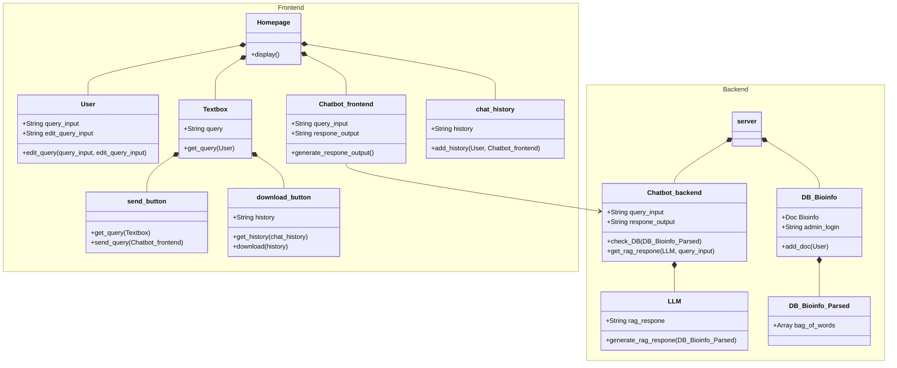
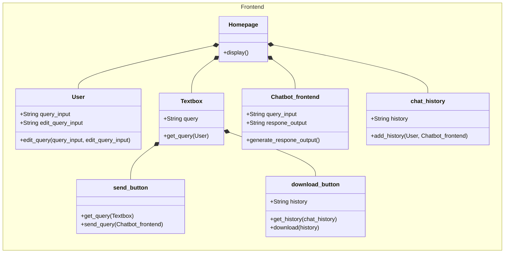
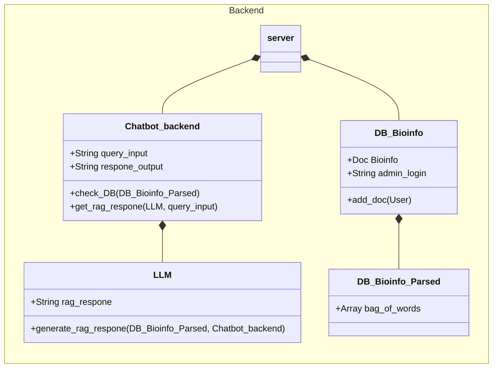

<!--Overview Section-->

## __Overview__

The class diagram above demonstrates various relationships between different classes within the two components of frontend and backend in the Bioinformatics Chatbot system. 

<!-- Frontend section -->
## __Frontend__

The frontend component shows the HomePage where everything will be displayed. The Homepage will be composed of the User, TextBox, Chatbot Frontend, ChatHistory. 
+ Chat_history is going to store all the respones from Chatbot and User
+ Chatbot_frontend is going to receive the query and generate a response output
+ User is able to enter or edit a query
+ TextBox is where the User's query will be shown
  + Send_button will sent the query from textbox to Chatbot_frontend
  + download_button will download the chathistory   

<!--Backend section -->
## Backend

The backend component shows the Server where a RAG(Retrieval-augmented generation) respone will be generated . The Server will be composed of the Chatbot_backend, BD_Bioinfo. 
+ BD_Bioinfo is going to be a database of Bioinformatics tutorials and lessons
  + BD_Bioinfo_Parsed is going to be a database that parses all the important information from the Bioinformatics tutorials and lessons into Bags of words	
+ Chatbot_backend is going to receive the query and check the BD_Bioinfo_Parsed for the information and then it going use LLM to generate a response 
  + LLM (Large Language Model) is going to use the query, BD_Bioinfo_Parsed to generate a RAG(Retrieval-augmented generation) response.
