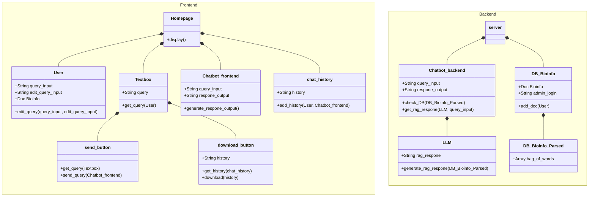
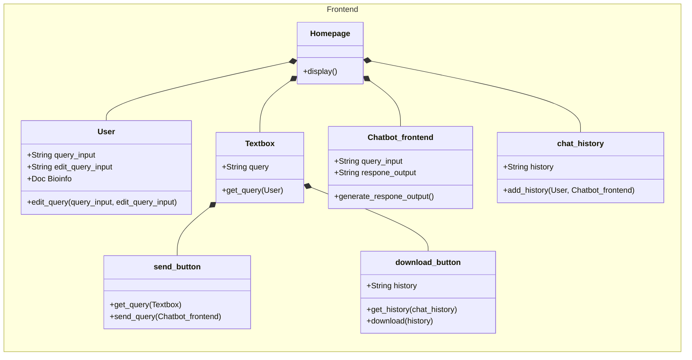
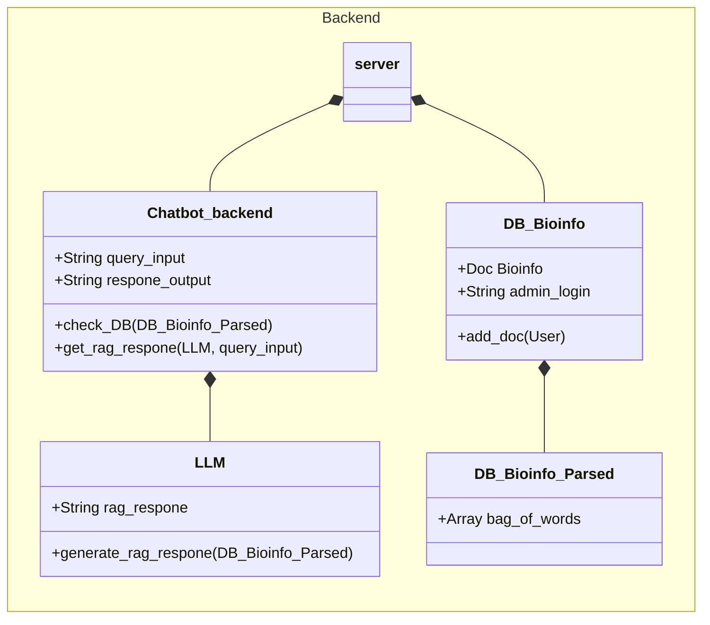

<!--Overview Section-->

## __Overview__

```mermaid
classDiagram
direction BT
	namespace Frontend {
        class Homepage {
	        +display()
        }

        class Chatbot_frontend {
	        +String query_input
	        +String respone_output
	        +generate_respone_output()
        }

        class chat_history {
	        +String history
	        +add_history(User, Chatbot_frontend)
        }

        class User {
	        +String query_input
	        +String edit_query_input
	        +Doc Bioinfo
	        +edit_query(query_input, edit_query_input)
        }

        class Textbox {
	        +String query
	        +get_query(User)
        }

        class send_button {
	        +get_query(Textbox)
	        +send_query(Chatbot_frontend)
        }

        class download_button {
	        +String history
	        +get_history(chat_history)
	        +download(history)
        }

	}
	namespace Backend {
        class server {
        }

        class Chatbot_backend {
	        +String query_input
	        +String respone_output
	        +check_DB(DB_Bioinfo_Parsed)
            +get_rag_respone(LLM, query_input)
        }

        class DB_Bioinfo{
	        +Doc Bioinfo
	        +String admin_login
	        +add_doc(User)
        }

        class DB_Bioinfo_Parsed{
            +Array bag_of_words
        }

        class LLM {
	        +String rag_respone
	        +generate_rag_respone(DB_Bioinfo_Parsed)
        }

	}

    Homepage *-- User
    Homepage *-- Textbox
    Homepage *-- Chatbot_frontend
    Homepage *-- chat_history
    Textbox *-- send_button
    Textbox *-- download_button

    server *-- Chatbot_backend
    server *-- DB_Bioinfo
    Chatbot_backend *-- LLM
    DB_Bioinfo *-- DB_Bioinfo_Parsed
    


```

<!-- Frontend section -->
## __Frontend__

```mermaid
classDiagram
direction BT
	namespace Frontend {
        class Homepage {
	        +display()
        }

        class Chatbot_frontend {
	        +String query_input
	        +String respone_output
	        +generate_respone_output()
        }

        class chat_history {
	        +String history
	        +add_history(User, Chatbot_frontend)
        }

        class User {
	        +String query_input
	        +String edit_query_input
	        +Doc Bioinfo
	        +edit_query(query_input, edit_query_input)
        }

        class Textbox {
	        +String query
	        +get_query(User)
        }

        class send_button {
	        +get_query(Textbox)
	        +send_query(Chatbot_frontend)
        }

        class download_button {
	        +String history
	        +get_history(chat_history)
	        +download(history)
        }

	}
    Homepage *-- User
    Homepage *-- Textbox
    Homepage *-- Chatbot_frontend
    Homepage *-- chat_history
    Textbox *-- send_button
    Textbox *-- download_button
```

<!--Backend section -->
## Backend

```mermaid
classDiagram
direction BT
	namespace Backend {
        class server {
        }

        class Chatbot_backend {
	        +String query_input
	        +String respone_output
	        +check_DB(DB_Bioinfo_Parsed)
            +get_rag_respone(LLM, query_input)
        }

        class DB_Bioinfo{
	        +Doc Bioinfo
	        +String admin_login
	        +add_doc(User)
        }

        class DB_Bioinfo_Parsed{
            +Array bag_of_words
        }

        class LLM {
	        +String rag_respone
	        +generate_rag_respone(DB_Bioinfo_Parsed)
        }

	}
    server *-- Chatbot_backend
    server *-- DB_Bioinfo
    Chatbot_backend *-- LLM
    DB_Bioinfo *-- DB_Bioinfo_Parsed
```
