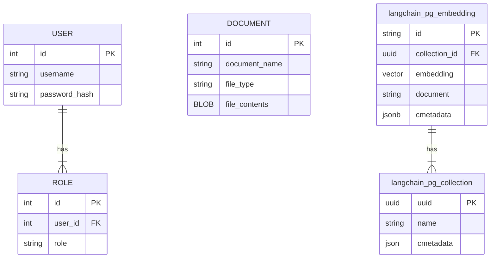

# Database Design

This Document is a summary of the database design for the project

## Entity-Relation Diagram

*Figure: Entity-Relation diagram*

### User Table
Used to store admin users which will be able to upload documents
- id: int - primary key
- username: string : unique username for user
- password_hash: string : password stored as a hash

### Role Table
Used to store roles of Users
- id: int - primary key
- user_id: int - foreign key (User: id) : contains a relation to a user
- role: string : the role of a user which brings permissions

### Document Table
Stores uploaded documents
- id: int - primary key
- document_name: string: name of uploaded document
- document_type: string: file extension of the document
- file_contents: BLOB: the uploaded file

### langchain_pg_collection
Stores pg vector collections from langchain | autogenerated
- uuid: uuid - primary key
- name: string: name of the collection
- metadata: json: metadata for the langchain collection

### langchain_pg_embedding
Stores langchain embeddings and utilizes PGvector | autogenerated
- id: string - primary key
- collection_id: uuid - foreign key (langchain_pg_collection: uuid) : collection the embedding belongs to
- embedding: vector: vector for the document embedding
- document: string: document in string form that the embedding will use
- cmetadata: jsonb: metadata for the embedding
