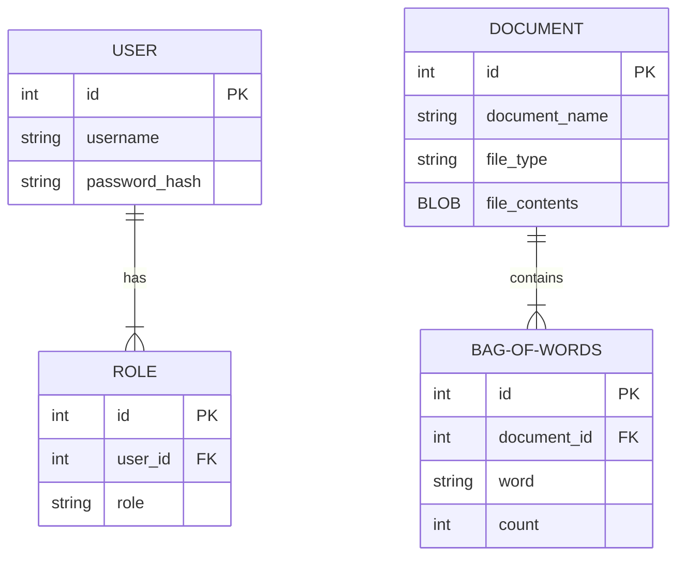

**Purpose**

The Design Document - Part I Architecture describes the software architecture and how the requirements are mapped into the design. This document will be a combination of diagrams and text that describes what the diagrams are showing.

**Requirements**

In addition to the general requirements the Design Document - Part I Architecture will contain:

A description the different components and their interfaces. For example: client, server, database.

For each component provide class diagrams showing the classes to be developed (or used) and their relationship.

Sequence diagrams showing the data flow for _all_ use cases. One sequence diagram corresponds to one use case and different use cases should have different corresponding sequence diagrams.

Describe algorithms employed in your project, e.g. neural network paradigm, training and training data set, etc.

## Entity-Relation Diagram

*Figure: Entity-Relation diagram*

### User Table
Used to store admin users which will be able to upload documents
- id: int - primary key
- username: string : unique username for user
- password_hash: string : password stored as a hash

### Role Table
Used to store roles of Users
- id: int - primary key
- user_id: int - foreign key (User: id) : contains a relation to a user
- role: string : the role of a user which brings permissions

### Document Table
Stores uploaded documents
- id: int - primary key
- document_name: string: name of uploaded document
- document_type: string: file extension of the document
- file_contents: BLOB: the uploaded file

### Bag of Words Table
Holds the bag of words for document searching
- id: int - primary key
- document_id: int - foreign key (Document: id) : contains a relation to an uploaded document
- word: string: one of the words in the related documents bag
- count: int: the number of times word shows up in the related document

