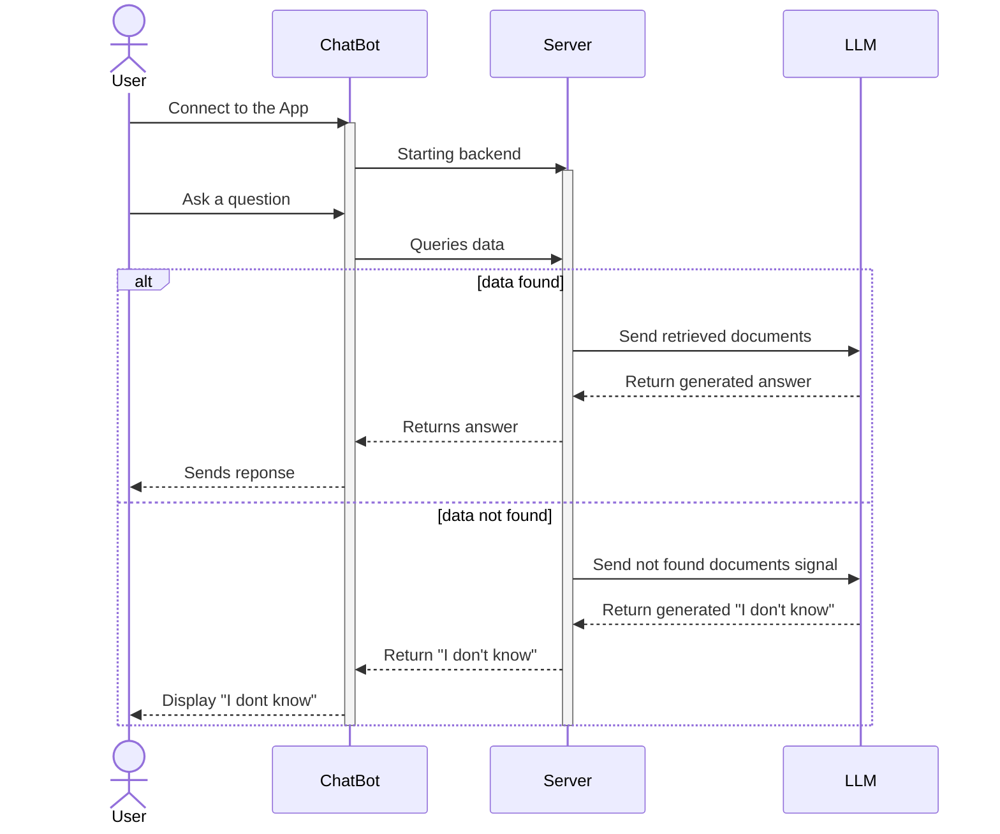
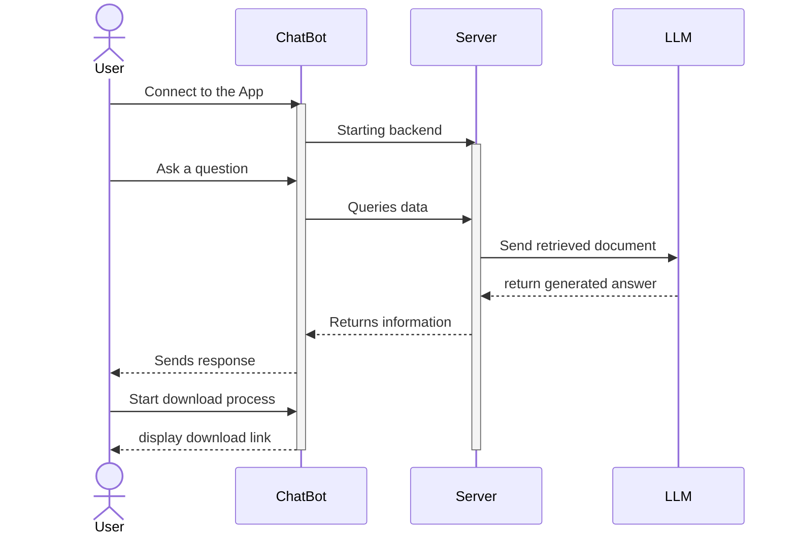
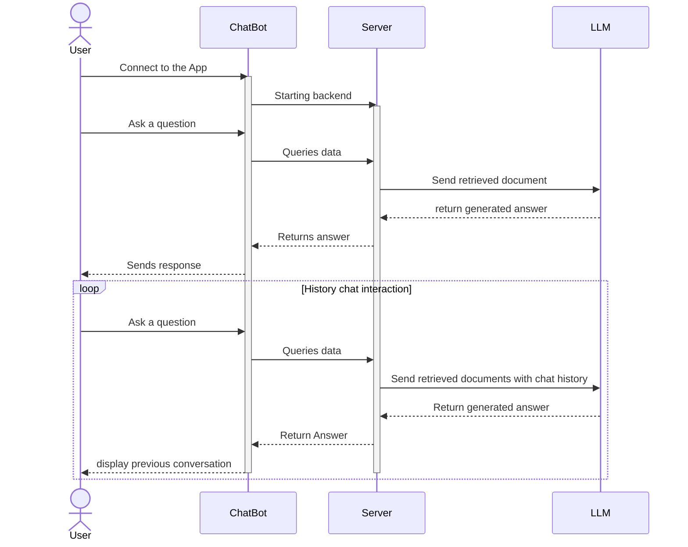
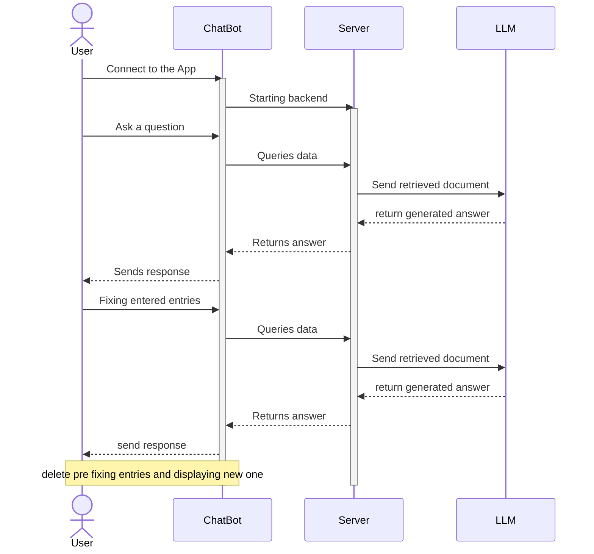
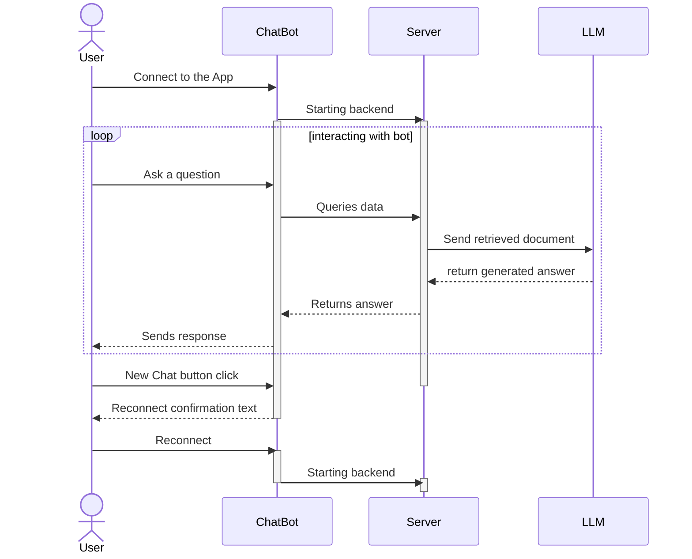

# Sequence Diagrams 

## 1: Question and Answer system

*Figure 1: ChatBot Question and Answer System Sequence Diagram*

## 2: Downloading function

*Figure 2: ChatBot downloading system Sequence Diagram*

## 3: Chat History

*Figure 3: ChatBot History System Sequence Diagram*

## 4: Edit queries / Resend queries

*Figure 4: ChatBot re-edit/ re-send queries System Sequence Diagram*

## 5: New/clear Chat

*Figure 5: ChatBot open new chat System Sequence Diagram*