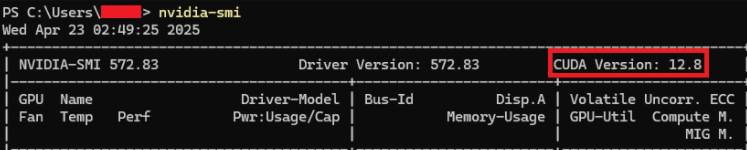
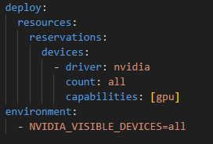
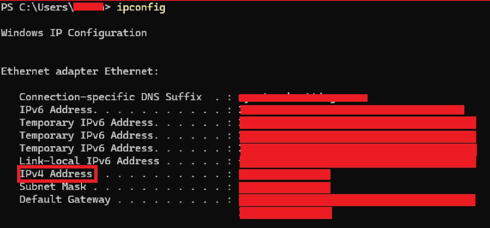
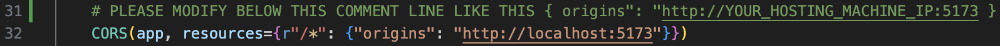
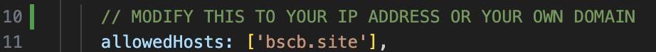

# Welcome to Hosting tutorial for you lab

#### Please make sure to read hardware requirement before proceeding to this page.

1. After clone Hosting Branch to your computer please verify your NVIDIA gpu is supporting CUDA by using this cmd in terminal/cmd below:  
`nvidia-smi`

2. Hosting branch is already configured to run the AI model and Embedding model with all visible GPUs. If you wish to change this setting modify this file:
`docker-compose.yml` under `backend` and `ollama` service.

3. Next check your local IP address using this cmd `ipconfig` in terminal and look for IPv4 Address:

4. Change your app hosting IP address to make it visible for all local network user.
- After getting your local hosting device IP address in step 3, please use it and modify `backend/app/__init__.py` line 31

- After modify your backend hosting IP please navigate to `frontend/vite.config.js` and replace localhost to your IP

